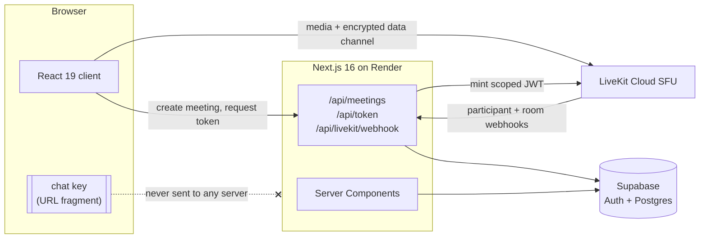

# VideoCircle

[](https://videocircle-blw4.onrender.com)
[](https://github.com/SidVaidya2005/VideoCircle/actions/workflows/github-code-scanning/codeql)
[](https://repowise.dev/repo/sidvaidya2005/videocircle)
[](https://repowise.dev/repo/sidvaidya2005/videocircle)
[](LICENSE)
[](https://www.typescriptlang.org/)
[](https://nextjs.org/)
[](https://livekit.io/)

Video calls in the browser. Start a meeting, send someone the link, and they're in
the call when they open it. They don't need an account, an app, or a meeting ID.
Google sign-in is there if you want a record of your past calls, and that's all
it's for.

The in-call chat is end-to-end encrypted. The key travels in the link's URL
fragment, so the server passes messages along without being able to read them.


## Contents

[Demo](#demo) · [Features](#features) · [How it works](#how-it-works) ·
[Architecture](#architecture) · [Security](#security) ·
[Screenshots](#screenshots) · [Stack](#stack) ·
[Project structure](#project-structure) · [Getting started](#getting-started) ·
[Non-goals](#non-goals) · [Status](#status) · [Documentation](#documentation) ·
[Licence](#licence)

## Demo

**[videocircle-blw4.onrender.com](https://videocircle-blw4.onrender.com)**

Expect the first visit to take about a minute. The app runs on Render's free tier,
which puts the instance to sleep after 15 minutes without traffic. While it wakes
up you'll see Render's loading page, not mine. After that it's fast.

## Features

- Google sign-in through Supabase Auth, or no account at all
- Unguessable meeting codes and shareable join links
- A lobby before you join: live self-preview, a display name, and your mic and
  camera set the way you want them
- Camera, microphone, and speaker pickers, in the lobby and during the call
- Video and audio for up to about 12 people
- A tile grid that reflows as people join, and you can pin anyone to the spotlight
- Screen sharing, which switches the layout to spotlight
- End-to-end encrypted chat (AES-GCM), keyed from the URL fragment
- A participant list showing who has their mic or camera on
- Reactions and raised hands, sent over the data channel
- Call history for signed-in users: when, how long, and who else was there
- Keyboard shortcuts: `d` toggles the mic and `e` the camera. They're ignored
  while you're typing
- Connection-quality indicators and automatic reconnection
- Works on phones, down to 360px wide, with 44px touch targets

## How it works

### The link is the key

When you create a meeting, your browser generates a 256-bit AES-GCM key and puts it
in the URL fragment: `/room/abc-defg-hjk#k=<key>`. Browsers don't send the fragment
to servers, so the only way the key reaches anyone is through the link you share.
It never shows up in a request, a log, or the database.

Messages are encrypted before they go out over LiveKit's data channel and
decrypted when they arrive. None of it is written to Postgres, and reloading the
page clears the transcript. So the operator can't read your chat because of how
the system is built, not because I promised not to look. If someone opens
`/room/[code]` without the fragment, the chat panel tells them they can't read it,
rather than showing them an empty conversation.

There's one exception. During Google sign-in, the fragment is held in
`sessionStorage` for the round trip and put back before anything reads it.
`sessionStorage` stays in the browser.

### Joining takes no setup

A guest opens the link, lands in the lobby, types a name, and joins. There's
nothing to download or sign up for. Each guest gets a new participant identity
every time they join, so nothing can tie one person's visits to two different
meetings together.

Signing in only adds call history. It never interrupts a call, because the auth
callback sends you back to the page you started from.

### Real-time media

Video, audio, and screen sharing go through a LiveKit SFU. The server mints each
access token for one room only, with a lifetime of at most an hour. The token
grants `roomJoin`, `canPublish`, `canSubscribe`, `canPublishData`, and
`canUpdateOwnMetadata`, and nothing more (no `roomAdmin`, `roomCreate`, or
`roomList`). If a code doesn't exist, or the meeting has ended or expired, the
server won't mint a token.

The client never writes call history. LiveKit sends webhooks when someone joins,
leaves, or the room empties. The handler checks the signature and records the
times from LiveKit's clock, not the server's.

### How it was tested

There are 242 unit tests and 136 end-to-end specs. Anything involving two people
is tested with two browser contexts, since a call that works with one person in it
hasn't really been tested.

I also made every test fail against a deliberate break before trusting it, and
that applied to the setup steps too. It paid off. Two "flaky" tests turned out to
share one bug in their setup: `getByText('Connected')` was also matching the
status bar's `Disconnected`, because it matches substrings. Every "wait until
connected" had been passing immediately.

That story and seven others are in
[`docs/ENGINEERING-NOTES.md`](docs/ENGINEERING-NOTES.md).

## Architecture



Meetings, profiles, and participation records live in Postgres, protected by
row-level security. Chat isn't stored anywhere. It exists as ciphertext on its way
between browsers, and as plaintext in the memory of the people holding the key.

The secrets are kept to specific files. `SUPABASE_SERVICE_ROLE_KEY` is only used in
`src/lib/supabase/admin.ts`. `LIVEKIT_API_SECRET` is only used in
`src/lib/livekit/token.ts`, to mint tokens, and `src/lib/livekit/webhook.ts`, to
check webhook signatures. All three files start with `import 'server-only'`.

## Security

### What is end-to-end encrypted, and what isn't

**Chat is.** The key is generated in the browser. When a key arrives through a
link it's imported as non-extractable, so page code can't read it back out. Each
message gets a new random 12-byte IV. That matters, because reusing an IV with the
same AES-GCM key breaks the encryption completely. The sender's identity is bound
in as additional authenticated data, so nobody can resend someone else's message
as their own. On the wire, a message is `iv || ciphertext`.

**Video and audio aren't.** Media is encrypted in transit with DTLS/SRTP, but the
SFU can decrypt it, which is how it routes streams. End-to-end encrypted media is
out of scope. I'd rather say so plainly than let "encrypted chat" suggest more
than it covers.

### The link works like a password

Anyone with the full link can join the meeting and read the chat. That's on
purpose: there's no waiting room and no host approval. It also means a leaked link
exposes the whole meeting. There's no way to change the chat key without sending
out a new link.

A room code is 10 characters from a 32-character alphabet, with look-alike
characters removed, generated with `crypto.getRandomValues`. That's **50 bits of
entropy**. Because 32 divides 256 evenly, there's no modulo bias either. As
[above](#real-time-media), a code only gets you a token if the meeting exists and
is still open.

### What the server can see

The server knows each meeting's code and who created it. For each person who
joined, it has their display name, their join and leave times, and a participant
identity. It never sees the chat key or any message.

### Boundaries

- Postgres uses row-level security. The one key that bypasses it lives in a single
  file that can't be imported into a client component.
- Incoming LiveKit webhooks are signature-checked: the signature is an HS256 JWT
  that carries a hash of the exact request body. Tests can't skip that check.
- Google is the only way to sign in. Supabase's email/password provider is turned
  off, because leaving it on would let anyone create an account by calling the
  Auth API directly, without going through any of this app's routes.
- A guest's participation record stays as long as the meeting does. That's how
  their name appears in other people's history. The identity on it is never
  reused, so it doesn't connect to anything else.

CodeQL scans the repository using GitHub's default setup.

## Screenshots

**The lobby.** Self-preview, device pickers, and your mic and camera state, set
before anyone sees or hears you.


**In a call.** The tile grid, the control bar, and the encrypted chat panel.


**Call history.** For signed-in users: when, how long, the code, and who else was
there.


These were captured with Playwright's fake devices, so the tiles show the
camera-off placeholder instead of video, and the device pickers list fake devices.

## Stack

TypeScript · Next.js 16 (App Router) · React 19 · LiveKit Cloud · Supabase (Auth +
Postgres) · Tailwind CSS 4 · shadcn/ui · Zod · Vitest · Playwright · Render.

## Project structure

119 source files, 57 test files, 8 SQL migrations.

```
src/
├── proxy.ts                  Refreshes the Supabase session on every request
├── app/
│   ├── (shell)/              Home and /history, the pages with the site header
│   ├── room/[code]/          One route: the lobby until you join, then the call
│   ├── api/                  meetings (create), token (mint), livekit (webhook)
│   ├── auth/                 OAuth callback and sign-out
│   └── healthz/              Render's health check
├── components/
│   ├── room/                 The call: grid, tiles, control bar, spotlight, invite
│   ├── lobby/                Self-preview, device pickers, joining
│   ├── chat/                 The encrypted chat panel
│   ├── history/, home/       Page-specific pieces
│   ├── shell/                Header, footer, account menu
│   └── ui/                   shadcn/ui primitives
├── hooks/                    Media preview and devices, chat key, encrypted chat,
│                             raise hand, call shortcuts, media queries
├── lib/
│   ├── crypto/               Chat key and message encryption (all AES-GCM code)
│   ├── livekit/              Token minting, TTL cap, webhook verification
│   ├── supabase/             Server, browser, and admin clients
│   ├── media/                Device preferences and error classification
│   └── *.ts                  Room codes, invite links, grid layout, history
└── types/                    Generated database types

tests/
├── unit/                     Vitest: crypto, room codes, formatting, pure logic
├── e2e/                      Playwright: lobby, join, calls, chat, webhooks
└── support/                  Helpers shared by both
```

The full tree, the data model, and the rules the code must follow are in
`context/architecture.md`.

## Getting started

You can run all of it locally: Google sign-in, starting a meeting, joining from a
second browser, screen sharing, and encrypted chat. You'll need real values for
all seven environment variables. None of them can be left as a placeholder.

### Prerequisites

- Node.js 20.9+ (set in `engines.node`; Render builds on 22)
- A [LiveKit Cloud](https://cloud.livekit.io) project (API key, secret, and `wss://` URL)
- A [Supabase](https://supabase.com) project with the Google provider enabled
- A Google Cloud OAuth 2.0 client with Supabase's callback URL registered

### Environment

Copy `.env.example` to `.env.local` and fill it in. Don't commit `.env.local`.

| Variable                        | Secret? | Notes                                           |
| ------------------------------- | ------- | ----------------------------------------------- |
| `NEXT_PUBLIC_SITE_URL`          | No      | Origin used for OAuth redirects and share links |
| `NEXT_PUBLIC_SUPABASE_URL`      | No      |                                                 |
| `NEXT_PUBLIC_SUPABASE_ANON_KEY` | No      |                                                 |
| `SUPABASE_SERVICE_ROLE_KEY`     | **Yes** | Bypasses RLS. Server only                       |
| `NEXT_PUBLIC_LIVEKIT_URL`       | No      | The `wss://` SFU URL                            |
| `LIVEKIT_API_KEY`               | **Yes** |                                                 |
| `LIVEKIT_API_SECRET`            | **Yes** | Also verifies webhook signatures                |

### Run it

```bash
npm install
npx supabase link --project-ref <your-project-ref>   # prompts for the DB password
npx supabase db push                                 # apply migrations
npm run dev                                          # http://localhost:3000
```

`db push` only works after `link`, and `link` asks for your database password. So
this is something you run yourself rather than something a script can do for you.

`localhost` counts as a secure context, so the Web Crypto API that encrypted chat
relies on works in development without HTTPS.

### Test it

```bash
npx playwright install chromium   # once per machine
npm run test       # Vitest: crypto, room codes, formatting
npm run test:e2e   # Playwright: lobby, join, two-person chat
npm run typecheck  # tsc --noEmit
npm run lint       # ESLint, Prettier, then the design-system and context-drift checks
```

The end-to-end tests start their own server on port 3100 instead of 3000, so they
never accidentally reuse a dev server you already have open. Playwright gives
Chromium fake camera and mic devices, so the call tests don't need real hardware.

### Deploy it

[`docs/DEPLOYMENT.md`](docs/DEPLOYMENT.md) covers the Render setup, what to check
before each deploy, and what you can only verify on the deployed site.

## Non-goals

I considered each of these and decided not to build it:

- **Recording**, cloud or local, and playback
- **End-to-end encrypted media**, which would mean giving up server-side routing
  (see [Security](#security))
- **Saved chat transcripts**. The encryption design makes this impossible, and
  that's the point
- **Waiting rooms, host admission, and moderation** (muting or removing people)
- **Virtual backgrounds and background blur**
- **Live transcription, captions, and translation**
- **Breakout rooms**
- **Scheduled meetings, calendar integration, and permanent personal rooms**
- **Native iOS and Android apps**, and dial-in by phone
- **File sharing, whiteboard, and polls**
- **Teams, organizations, and billing**

## Status

Done. All 26 planned features, across 8 phases, are built, tested, and deployed.
Against a production build, `lint`, `typecheck` and `build` pass, along with 242
unit tests and 136 e2e specs.

A few things are still open. I haven't run Lighthouse with mobile throttling, and
I haven't held a ten-minute call with four people on the deployed site. Both need
people and devices rather than a code change. Two mobile details, the safe-area
padding on a notched phone and the chat box staying above the iOS keyboard, looked
fine during a real session on phones. Nobody has checked them specifically, so the
docs say "reported working" rather than "verified".

`context/progress-tracker.md` has the current status. It's updated after every
feature, so trust it over this section.

## Documentation

`context/` holds the project's design and decision documents, and `CLAUDE.md` is
where AI agents working on the repo start. Someone who has never seen `src/` should
be able to read `context/` and understand what the product is, how it's built,
why, and what rules the code follows.

| File                          | Contents                                                |
| ----------------------------- | ------------------------------------------------------- |
| `context/project-overview.md` | What the product is, scope in and out, success criteria |
| `context/architecture.md`     | Stack, structure, data model, and the invariants        |
| `context/code-standards.md`   | Rules every change follows                              |
| `context/library-docs.md`     | How each library is used here                           |
| `context/build-plan.md`       | 8 phases, 26 features, in build order                   |
| `context/progress-tracker.md` | Current build status                                    |
| `context/constraints.md`      | Decisions that still apply                              |
| `context/build-journal.md`    | Decisions and surprises, feature by feature             |
| `context/Design/`             | The design system, adapted from the Anime.js kit        |
| `docs/DEPLOYMENT.md`          | Render deployment and pre-deploy checks                 |
| `docs/ENGINEERING-NOTES.md`   | Bugs that taught me more than their fix did             |

## Licence

MIT. See [`LICENSE`](LICENSE).

The design kit in `context/Design/` is based on
[Anime.js](https://animejs.com) by Julian Garnier. The `IoskeleyMono` font files in
that folder are for reference only and aren't shipped. The app uses JetBrains Mono
instead.
