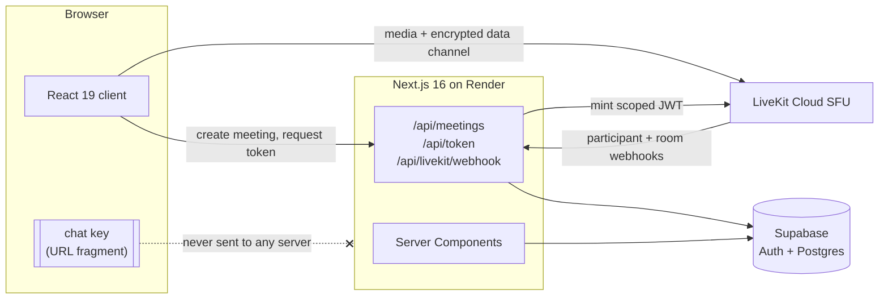

# VideoCircle

[](https://videocircle-blw4.onrender.com)
[](https://github.com/SidVaidya2005/VideoCircle/actions/workflows/github-code-scanning/codeql)
[](https://repowise.dev/repo/sidvaidya2005/videocircle)
[](https://repowise.dev/repo/sidvaidya2005/videocircle)
[](LICENSE)
[](https://www.typescriptlang.org/)
[](https://nextjs.org/)
[](https://livekit.io/)

Browser-based video calling. Start a meeting, share the link, and anyone who opens
it is in the call — no account, no install, no meeting ID. Sign in with Google only
if you want your call history kept.

Chat inside the call is end-to-end encrypted in the browser, with the key carried in
the link's URL fragment. The server relays bytes it cannot read.


## Contents

[Demo](#demo) · [Features](#features) · [How it works](#how-it-works) ·
[Architecture](#architecture) · [Security](#security) ·
[Screenshots](#screenshots) · [Stack](#stack) ·
[Project structure](#project-structure) · [Getting started](#getting-started) ·
[Non-goals](#non-goals) · [Status](#status) · [Documentation](#documentation) ·
[Licence](#licence)

## Demo

**[videocircle-blw4.onrender.com](https://videocircle-blw4.onrender.com)**

The first visit takes about a minute. It runs on a Render free instance, which spins
down after 15 minutes without traffic; Render serves its own loading page while it
wakes, before any application code runs. Once awake it is quick.

## Features

- Google sign-in via Supabase Auth, plus fully anonymous guest access
- Unguessable meeting codes and shareable join links
- Pre-join lobby with live self-preview, display-name entry, and mic/camera state
- Camera, microphone, and speaker pickers, usable in the lobby and mid-call
- Multi-party video and audio, sized for up to ~12 participants
- Responsive tile grid that reflows by participant count, with pin-to-spotlight
- Screen sharing, with spotlight view on share
- End-to-end encrypted in-meeting chat (AES-GCM), key carried in the URL fragment
- Participant list showing everyone's mic and camera state
- Reactions and raise-hand over the data channel
- Call history for signed-in users: meeting, time, duration, and co-participants
- Keyboard shortcuts in the call — `d` toggles the microphone, `e` the camera,
  both suppressed while you are typing
- Connection-quality indicators and automatic reconnection handling
- Mobile web support — responsive layouts and 44px touch targets down to 360px

## How it works

### The link is the key

Creating a meeting generates a 256-bit AES-GCM key in the browser and puts it in the
URL fragment: `/room/abc-defg-hjk#k=<key>`. Browsers never transmit a fragment to a
server, so the key reaches other participants through the share link and nowhere
else. It appears in no request, no log, and no database row.

Messages are encrypted before they are published over the LiveKit data channel and
decrypted on arrival. Nothing is written to Postgres, and reloading clears the
transcript — chat is private from the operator by construction rather than by
promise. Someone who opens `/room/[code]` without the fragment is told they cannot
read chat, rather than shown an empty panel.

The one permitted detour is `sessionStorage` across the OAuth round trip, which
never leaves the browser; the fragment is restored before anything reads it.

### Joining costs nothing

A guest opens the link, lands in the lobby, types a display name, and joins. No
download, no install, no extension, no sign-up. Guests get a participant identity
minted fresh at join time and never reused, so no query can link one guest's
appearances across two meetings.

Signing in is only for call history, and never interrupts a call — the auth callback
returns to the page it started from.

### Real-time media

Video, audio, and screen sharing run over a LiveKit SFU. Access tokens are minted
server-side, scoped to one room, capped at a one-hour TTL, and granted exactly
`roomJoin`, `canPublish`, `canSubscribe`, `canPublishData`, and
`canUpdateOwnMetadata` — never `roomAdmin`, `roomCreate`, or `roomList`. A token
request for an unknown, ended, or expired code is refused.

Call history is not written by the client. LiveKit webhooks report who joined, who
left, and when the room emptied; the handler verifies the signature and records
participation against LiveKit's clock rather than the server's.

### How it was tested

242 unit tests and 136 end-to-end specs. Two-participant flows run in two browser
contexts, because a call that works alone has not been tested.

The suite's own preconditions are held to the same standard as its assertions. Every
test was seen to fail against a deliberate break before being trusted — a discipline
that caught two long-standing "flakes" which turned out to be one vacuous wait:
`getByText('Connected')` was matching the status strip's own `Disconnected` as a
substring, so every wait for a connected room had been returning instantly.

That one and seven others are written up in
[`docs/ENGINEERING-NOTES.md`](docs/ENGINEERING-NOTES.md).

## Architecture



Meetings, profiles, and participation live in Postgres behind row-level security.
Chat has no server-side data domain at all: messages exist only as ciphertext in
flight and as plaintext in the memory of participants holding the key.

Secrets have exactly one home each — `SUPABASE_SERVICE_ROLE_KEY` in
`src/lib/supabase/admin.ts`, `LIVEKIT_API_SECRET` in `src/lib/livekit/token.ts` —
and both files begin with `import 'server-only'`.

## Security

### What is end-to-end encrypted, and what is not

**Chat is.** A 256-bit AES-GCM key is generated in the browser and imported
non-extractable, so a key that arrived from a link cannot be read back out. Every
message gets a fresh 12-byte IV — never a module constant, because nonce reuse under
one AES-GCM key is a total break rather than a weakness — and the sender's identity is
passed as additional authenticated data, so one participant cannot replay another's
ciphertext under their own name. The wire format is `iv || ciphertext` over the
LiveKit data channel.

**Video and audio are not.** Media is DTLS/SRTP encrypted in transit but decryptable
at the SFU, which is what makes server-side routing possible. End-to-end encrypted
media is explicitly out of scope, and the README would be lying by omission if it let
"end-to-end encrypted chat" imply otherwise.

### The link is a bearer credential

Anyone holding the full link can join the meeting and read its chat. That is the
design, not a gap — there is no waiting room and no host admission. It also means a
leaked link is a leaked meeting, and the chat key cannot be rotated without handing
out a new link.

Room codes are 10 characters from a 32-symbol alphabet with the ambiguous glyphs
removed, drawn from `crypto.getRandomValues` — **50 bits of entropy**, and the
alphabet size divides 256 evenly so there is no modulo bias. A token request for an
unknown, ended, or expired code is refused.

### What the server can see

Meeting codes, who created them, and participation rows: a display name, a
join/leave timestamp, and a participant identity. It never sees a chat key or a
message body. The key is read from `window.location.hash` and nowhere else, and
appears in no request, no log, and no database row — the one permitted detour is
`sessionStorage` across the OAuth round trip, which never leaves the browser.

### Boundaries

- Postgres is behind row-level security. The service-role key bypasses RLS and lives
  in exactly one file, which cannot be imported from a client component.
- LiveKit tokens are minted server-side, scoped to one room, capped at a one-hour
  TTL, and never carry `roomAdmin`, `roomCreate`, or `roomList`.
- Inbound LiveKit webhooks are signature-verified — an HS256 JWT whose claim is a
  digest of the exact body bytes — with no test-only path through the route.
- Google is the only sign-in method, and the Supabase email/password provider is
  disabled, because an enabled one is a live account-creation surface reachable
  straight from the Auth API, outside every route handler here.
- Guests get a participant identity minted fresh at each join and never reused, so no
  query can link one guest's appearances across two meetings. Their participation row
  does persist as long as the meeting does — that is what puts their name in other
  participants' history — it simply links to nothing else.

CodeQL runs on this repository through GitHub's default setup.

## Screenshots

**The lobby** — self-preview, device pickers, and mic/camera state, set before
anyone else sees or hears you.


**In a call** — the tile grid, the control bar, and the encrypted chat panel.


**Call history** — for signed-in users: when, how long, the code, and who else was
there.


Screenshots are captured with Playwright's synthetic devices, so the tiles show the
camera-off placeholder rather than video, and the device pickers name fake devices.

## Stack

TypeScript · Next.js 16 (App Router) · React 19 · LiveKit Cloud · Supabase (Auth +
Postgres) · Tailwind CSS 4 · shadcn/ui · Zod · Vitest · Playwright · Render.

## Project structure

119 source files, 57 test files, 8 SQL migrations.

```
src/
├── proxy.ts                  Supabase session refresh on every request
├── app/
│   ├── (shell)/              Home and /history — the pages inside the site shell
│   ├── room/[code]/          One route, two states: lobby until Join, then the call
│   ├── api/                  meetings (create), token (mint), livekit (webhook)
│   ├── auth/                 OAuth callback and sign-out
│   └── healthz/              Render's health probe
├── components/
│   ├── room/                 The call: grid, tiles, control bar, spotlight, invite
│   ├── lobby/                Self-preview, device pickers, join handoff
│   ├── chat/                 The encrypted chat panel
│   ├── history/, home/       Page-specific surfaces
│   ├── shell/                Header, footer, auth menu
│   └── ui/                   shadcn/ui primitives
├── hooks/                    Media preview and devices, chat key, encrypted chat,
│                             raise hand, call shortcuts, media queries
├── lib/
│   ├── crypto/               Chat key and message envelope — the AES-GCM boundary
│   ├── livekit/              Token minting, TTL cap, webhook verification
│   ├── supabase/             Server, browser, and admin clients
│   ├── media/                Device preferences and error classification
│   └── *.ts                  Room codes, invite links, grid layout, history
└── types/                    Generated database types

tests/
├── unit/                     Vitest — crypto, room codes, formatting, pure logic
├── e2e/                      Playwright — lobby, join, calls, chat, webhooks
└── support/                  Shared by both suites
```

`context/architecture.md` carries the full tree, the data model, and the invariants.

## Getting started

Everything works locally: sign in with Google, start a meeting, share the link, join
from a second browser context, share a screen, and chat end-to-end encrypted. All
seven environment variables are real requirements — none is a placeholder.

### Prerequisites

- Node.js 20.9+ (pinned as `engines.node`; Render builds on 22)
- A [LiveKit Cloud](https://cloud.livekit.io) project (API key, secret, and `wss://` URL)
- A [Supabase](https://supabase.com) project with the Google OAuth provider enabled
- A Google Cloud OAuth 2.0 client, with Supabase's callback URL registered

### Environment

Copy `.env.example` to `.env.local` and fill it in. Never commit `.env.local`.

| Variable                        | Secret? | Notes                                           |
| ------------------------------- | ------- | ----------------------------------------------- |
| `NEXT_PUBLIC_SITE_URL`          | No      | Origin used for OAuth redirects and share links |
| `NEXT_PUBLIC_SUPABASE_URL`      | No      |                                                 |
| `NEXT_PUBLIC_SUPABASE_ANON_KEY` | No      |                                                 |
| `SUPABASE_SERVICE_ROLE_KEY`     | **Yes** | Bypasses RLS — server only                      |
| `NEXT_PUBLIC_LIVEKIT_URL`       | No      | The `wss://` SFU URL                            |
| `LIVEKIT_API_KEY`               | **Yes** |                                                 |
| `LIVEKIT_API_SECRET`            | **Yes** | Also verifies webhook signatures                |

### Run it

```bash
npm install
npx supabase link --project-ref <your-project-ref>   # prompts for the DB password
npx supabase db push                                 # apply migrations
npm run dev                                          # http://localhost:3000
```

`db push` needs the project linked first, and the link prompts for your database
password — which is why it is a step you run rather than one a script runs for you.

`localhost` counts as a secure context, so the Web Crypto APIs behind encrypted chat
work in development without HTTPS.

### Test it

```bash
npx playwright install chromium   # once per machine
npm run test       # Vitest — crypto, room codes, formatting
npm run test:e2e   # Playwright — lobby, join, two-party chat
npm run typecheck  # tsc --noEmit
npm run lint       # ESLint, Prettier, then the design-system and context-drift checks
```

The end-to-end server runs on port 3100, not 3000, so a dev server you already have
open is never reused by mistake. Playwright launches Chromium with fake media
devices, so call flows run without a real camera.

### Deploy it

See [`docs/DEPLOYMENT.md`](docs/DEPLOYMENT.md) for the Render setup, the checks to
run before every deploy, and what can only be verified on a deployed origin.

## Non-goals

Deliberately not built. Each was considered and ruled out, rather than left undone:

- **Recording**, cloud or local, and playback
- **End-to-end encrypted media** — see [Security](#security); it would mean giving up
  server-side routing
- **Persisted chat transcripts** — structurally impossible under this encryption
  model, and that is the point
- **Waiting rooms, host admission, and moderation** (mute-others, remove-participant)
- **Virtual backgrounds and background blur**
- **Live transcription, captions, and translation**
- **Breakout rooms**
- **Scheduled meetings, calendar integration, and persistent personal rooms**
- **Native iOS and Android apps**, and dial-in / PSTN telephony
- **File sharing, whiteboard, and polls**
- **Teams, organizations, and billing**

## Status

Complete. All 26 planned features across 8 phases are built, verified, and deployed;
`lint`, `typecheck`, `build`, 242 unit tests and 136 e2e specs all pass against a
production build.

Two things are recorded as unmeasured rather than passing, both needing hardware
rather than a change: a Lighthouse run under mobile throttling, and a ten-minute
four-participant call on the deployed instance. Two mobile details — safe-area
insets on a notched phone, and the chat composer above the iOS keyboard — were
reported working from a real device session rather than probed for, and are written
down that way.

`context/progress-tracker.md` is the live status and is more current than this
section by construction.

## Documentation

`context/` is the source of truth for this project, and `CLAUDE.md` is the entry
point for AI agents working in the repo. It is written to stand on its own: someone
with no access to `src/` can read it and understand what the product is, how it is
built, why, and what the rules are.

| File                          | Contents                                                |
| ----------------------------- | ------------------------------------------------------- |
| `context/project-overview.md` | What the product is, scope in and out, success criteria |
| `context/architecture.md`     | Stack, structure, data model, and the invariants        |
| `context/code-standards.md`   | Rules every change follows                              |
| `context/library-docs.md`     | Per-library usage patterns                              |
| `context/build-plan.md`       | 8 phases, 26 ordered features                           |
| `context/progress-tracker.md` | Live build status                                       |
| `context/constraints.md`      | Decisions that still bind                               |
| `context/build-journal.md`    | Decisions and gotchas, per feature                      |
| `context/Design/`             | The Anime.js brand kit this project is designed against |
| `docs/DEPLOYMENT.md`          | Render deployment and pre-deploy checks                 |
| `docs/ENGINEERING-NOTES.md`   | Bugs that were worth more than their fix                |

## Licence

MIT — see [`LICENSE`](LICENSE).

The design kit under `context/Design/` is derived from
[Anime.js](https://animejs.com) by Julian Garnier. It includes `IoskeleyMono` font
files that are **reference only and not shipped** — the application loads JetBrains
Mono instead.
